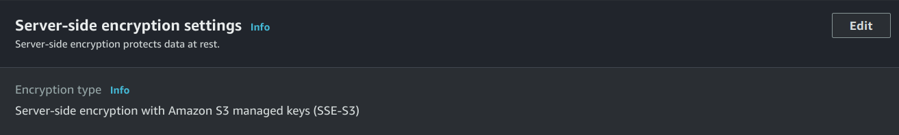
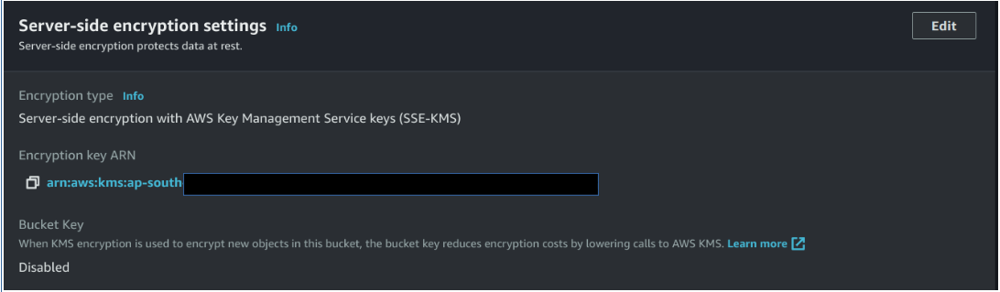
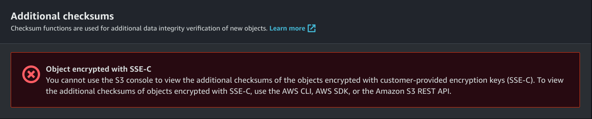

# Edge AI security using AWS Server-side encryption
## Introduction
The goal of this project is to explore security encryption techniques for passing images from edge devices to the cloud using AWS Boto3 object encryption techniques. By achieving this goal, we aim to ensure the confidentiality and authenticity of the transmitted image data, mitigating potential security risks and unauthorized access throughout the data transmission process which will strengthen the security of the edge-to-cloud communication, enabling safer utilization of AI-driven applications in various domains. 

## AWS Server-side encryption:  

AWS S3 provides several server-side encryption options to automatically encrypt your data at rest. You can choose from the following SSE options: 
- SSE-S3: Server-Side Encryption with Amazon S3-Managed Keys: This option encrypts the object using Amazon S3-managed keys. The encryption is transparent and managed by AWS. 

- SSE-KMS: Server-Side Encryption with AWS Key Management Service (KMS)-Managed Keys: With this option, the object is encrypted using a KMS key managed by AWS KMS. You can have more control over the encryption and access to the key. 

- SSE-C: Server-Side Encryption with Customer-Provided Keys: This option allows users to provide their own encryption keys. Users need to manage the encryption key and provide it with each request to read or write the object. 

The encryption will be done using AES256 algorithm. AES (Advanced Encryption Standard) with a key size of 256 bits (AES256) is a widely used symmetric encryption algorithm. AES256 employs a fixed block size of 128 bits and processes data in blocks of 128 bits at a time. The key size of 256 bits provides a vast number of possible keys, making brute-force attacks computationally infeasible. AES256 encryption and decryption use the same secret key, making it a symmetric encryption algorithm. Due to its strength and efficiency, AES256 is widely adopted for securing data during transmission and storage, ensuring confidentiality and data integrity. 

## Prerequisites: 
1. A Linux host system with Ubuntu 18.04.
2. Flash the RB5 firmware image on to the RB5.
3. Setup the Network on RB5 using below link https://developer.qualcomm.com/qualcomm-robotics-rb5-kit/quick-start-guide/qualcomm_robotics_rb5_development_kit_bring_up/set-up-network  
4. Install Python3.6 on RB5 

### Installing Dependencies
- Python packages installation ons RB5
  ``` sh
  ubuntu@ubuntu: adb shell
  sh # python3 -m pip install --upgrade pip
  sh # pip install botocore==1.24.32 
  sh # pip install boto3==1.21.32 
  sh # pip install tqdm==4.64.0 
  ```
    
## Steps to upload and download image file 

1. Clone the project on host system.
```sh
$ git clone https://github.com/globaledgesoft/Edge-AI-security-using-AWS-boto3
```
2. Push the cloned source code from host system to RB5 in the project directory. 
``` sh
$ adb push <host_system>/Edge-AI-security-using-AWS-boto3/ /data/
```
If connecting through SSH  
``` sh
$ adb push <host_system>/Edge-AI-security-using-AWS-boto3/ /data/
```

3. SSH into the RB5 bot 
```sh
$ ssh root@<IP_ADDRESS_OF_RB5_BOT> 
```

3. Navigate to Edge-AI-security-using-AWS-boto3 folder. 
```sh
sh: cd /data/Edge-AI-security-using-AWS-boto3
```

4. Update the AWS config: Edit Edge-AI-security-using-AWS-boto3 config/aws_config.json file with aws access_key, secret_key, bucket_name, region. 
<br>
- To use default Amazon S3 managed keys (SSE-S3) encryption technique:  
```sh<br>
$ python main.py -e default 
 ```
<br>
- To use AWS Key Management Service keys (SSE-KMS)  
```sh
<br>
Replace e_key in main.py with your AWS KMS key KEY_ARN <br>
$ python main.py -e KMS 
<br>
``` <br>

<br>
- To use customer-provided encryption keys (SSE-C)  
<br>
Edit e_key in main.py and choose any key of 32 byte of your choice.  
```sh
$ python main.py -e SSE_C 
```
<br>

<br>

The main.py file will upload the image from the device to the AWS S3 bucket using the encryption technique of your choice and will also download the file with the same encryption technique as used to upload the file. 